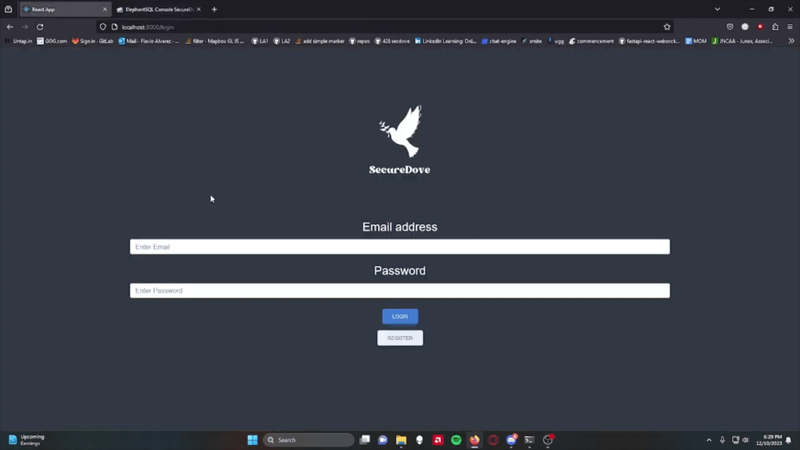

<h1 align="center">SecureDove</h1>

  

  

  

  

SecureDove is a secure instant messaging application developed as part of our Software Security and Reverse Engineering course. Our team of five utilized a "build-break-fix" methodology to design, assess, and enhance the application's security. The project involved implementing clear security measures such as end-to-end encryption and multi-factor authentication, identifying and addressing vulnerabilities through comprehensive testing, and applying advanced techniques to safeguard user data and ensure message integrity.

Watch the Full Video Demo Here

---

# Table of Contents
- [What I Learned](#what-i-learned-in-this-project)
- [Tools Used / Development Environment](#tools-used--development-environment)
- [Team / Contributors / Teachers](#team--contributors--teachers)
- [How to Set Up](#how-to-set-up)
- [Project Overview](#project-overview)
  - [Project Details](#project-details)
    - [Assure Deliverable](#assure-deliverable)
    - [Assess Deliverable](#assess-deliverable)
    - [Amend Deliverable](#amend-deliverable)
  - [Technical Details](#technical-details)
  - [Files and Structure](#files-and-structure)
  - [Results and Presentation](#results-and-presentation)
  - [Future Work](#future-work)
- [Acknowledgments](#acknowledgments)

---

# What I Learned in this Project
- Develop and secure a web application, focusing on identifying and addressing security vulnerabilities.
- Conduct security assessments including penetration testing and vulnerability analysis.
- Implement security best practices, such as end-to-end encryption, multi-factor authentication, and secure coding techniques.

# Tools Used / Development Environment
- Python
- VS Code
- Terminal
- Windows 10
- **Frontend:** ReactJS
- **Backend:** FastAPI
- **Database:** PostgreSQL (ElephantSQL)

# Team / Contributors / Teachers
- [Mitchell Kolb](https://github.com/mitchellkolb)
- [Muhammad Ali Dzulfiqar](https://github.com/AliDzulfiqar)
- [Flavio Alvarez Penate](https://github.com/f-alvarezpenate)
- [Phearak Both Bunna](https://github.com/Phearakbothbunna)
- [Jaysen Anderson](https://github.com/JaysenWSU)
- Professor. Haipeng Cai
- Team Name: ABFMJ

# How to Set Up
This project was implemented on our local machine:
- Clone this repository 
- Open terminal at the codebase `~.../SecureDove/securedove`

To run the frontend:
1. install node.js
2. in the frontend directory, run the command `npm install` to enable node modules
3. in the same directory, run the command `npm start` to initialize app

To run the backend:
1. travel to the /backend directory
2. run `pip install -r requirements.txt` to install libraries needed
3. run command `uvicorn main:app --reload` to run backend on local port 8000

# Project Overview 

## Project Details
In this project, we applied the principles and methodologies learned in our Software Security and Reverse Engineering course to develop a secure instant messaging application named SecureDove. The project followed a "build-break-fix" methodology, focusing on creating a secure application, identifying its vulnerabilities, and then implementing solutions to mitigate these vulnerabilities.

### Assure Deliverable
In this phase, we identified the specific requirements of the project, focusing on concrete security goals and metrics. We designed and implemented the initial version of the SecureDove application, incorporating security measures such as end-to-end encryption and multi-factor authentication.

### Assess Deliverable
In this phase, we performed security assessments to identify vulnerabilities within the SecureDove application. We conducted various tests and developed attacks to exploit these vulnerabilities, documenting our findings and the methods used to compromise the application's security.

### Amend Deliverable
In this phase, we implemented enhanced security measures to address the vulnerabilities identified during the assessment phase. We updated our software design, re-implemented the application, and conducted regression testing to validate the effectiveness of the new security measures.

## Technical Details
The project employs a modern tech stack to achieve its objectives:
- **Frontend:** Built with ReactJS, utilizing React Router DOM for navigation and state management.
- **Backend:** Implemented using FastAPI, with a PostgreSQL database hosted on ElephantSQL.
- **Security Measures:** Included end-to-end encryption, multi-factor authentication, hashed passwords, and secure API key management.

## Files and Structure
- `frontend/`: Contains the ReactJS frontend code.
- `backend/`: Contains the FastAPI backend code.
- `.env`: Stores environment variables such as the API key (not included in the repository for security reasons).
- `config.py`: Loads environment variables for the backend.

## Results and Presentation
During development, we identified several vulnerabilities and implemented fixes to secure the application. Below are some screenshots of SecureDove’s user interface:

## Future Work
Future improvements could include:
- Implementing web sockets for real-time messaging to enhance user experience.
- Adding session tokens and improved session management for better security.
- Implementing a user timeout feature after multiple failed login attempts to mitigate brute force attacks.

--- 
# Acknowledgments
This codebase and all supporting materials was made as apart of a course for my undergrad at WSU for CPTS 428 - Software Security and Reverse Engineering in the Fall of 2023. Our original repository can be found at this link. I forked it so I could add our documents and make the readme include more detail. Here is the original repo: [CptS428-ABFMJ-SecureDove](https://github.com/AliDzulfiqar/CptS428-ABFMJ-SecureDove)

